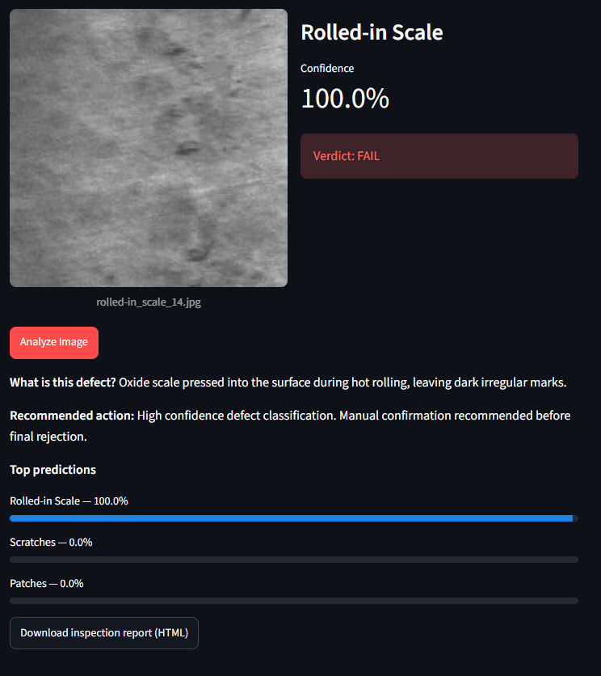
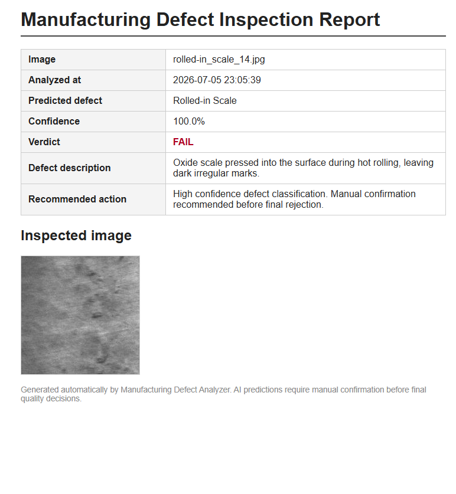

# Manufacturing Defect Analyzer

AI-powered visual inspection app that classifies surface defects on
hot-rolled steel strips. Upload an image, get the predicted defect type,
a confidence score, an explanation and a downloadable inspection report.

Built as a demonstration of computer vision for industrial quality control.

## Defect classes

Six classes from the [NEU Surface Defect Database](https://www.kaggle.com/datasets/kaustubhdikshit/neu-surface-defect-database)
(1,800 grayscale images, 300 per class):

| Class | Description |
|---|---|
| Crazing | Network of fine thermal-stress cracks |
| Inclusion | Non-metallic particles embedded in the surface |
| Patches | Irregular regions with different texture/color |
| Pitted Surface | Small corrosion/gas cavities |
| Rolled-in Scale | Oxide scale pressed in during hot rolling |
| Scratches | Linear mechanical surface damage |

## Screenshots

Analysis result with prediction, confidence and recommendation:



Generated HTML inspection report:



## Architecture

- **Classification:** ResNet18 (ImageNet pretrained), final layer replaced
  with 6 classes — transfer learning, Adam, cross-entropy
- **Detection:** YOLOv8-nano fine-tuned on NEU-DET bounding-box annotations,
  localizes defects with boxes and per-defect confidence
- **App:** Streamlit — upload, classify or detect, explain, HTML report

## Results

**Classification (ResNet18, 15% held-out test set):** 100% accuracy —
all 270 test images correct across all six classes. NEU-CLS is a clean,
studio-condition benchmark; published transfer-learning results are
similarly in the 99–100% range. Real production-line imagery would be
substantially harder.

**Detection (YOLOv8n, 256px, 40 epochs, NEU-DET test split):**

| Class | mAP50 |
|---|---|
| patches | 0.95 |
| scratches | 0.86 |
| inclusion | 0.85 |
| pitted_surface | 0.79 |
| rolled-in_scale | 0.59 |
| crazing | 0.46 |
| **all** | **0.75** |

mAP50-95: 0.42. Diffuse, texture-like defects (crazing, rolled-in scale)
are hard to box tightly — a known property of this benchmark — while
localized defects (patches, inclusions, scratches) detect reliably.
Inference runs at ~18 ms/image on CPU.

## Setup

```bash
python -m venv .venv
.venv\Scripts\activate        # Windows
pip install -r requirements.txt
```

## Data preparation

1. Download the NEU-DET dataset from Kaggle
   (`kaggle datasets download kaustubhdikshit/neu-surface-defect-database`)
   and extract it into `data/raw/`.
2. Split into train/val/test (70/15/15):

```bash
python model/prepare_data.py
```

## Training

Classification (ResNet18):

```bash
python model/train.py --epochs 15
```

The best checkpoint (by validation accuracy) is saved to
`model/saved_models/resnet18_neu.pt`, plus a `.metrics.json` with the
test-set classification report.

Detection (YOLOv8n) — expects the YOLO-format NEU-DET under `data/yolo/`
(images + labels + `data.yaml`):

```bash
python model/train_yolo.py --epochs 40
```

The best weights are saved to
`model/saved_models/yolov8n_neu/weights/best.pt`; once present, the app
enables the "Defect Detection (YOLO)" mode.

## Running the app

```bash
streamlit run app/streamlit_app.py
```

## CLI prediction

```bash
# classification: class + confidence + top-3
python model/predict.py data/sample_images/scratches_1.jpg

# detection: boxes + per-defect confidence, optionally save annotated image
python model/predict_yolo.py data/sample_images/scratches_1.jpg --out annotated.jpg
```

## Project structure

```
├── app/                  # Streamlit UI, report generator, defect info
├── model/                # training, prediction, data prep
│   └── saved_models/     # checkpoints (gitignored)
├── data/
│   ├── raw/              # extracted NEU-DET dataset (gitignored)
│   ├── processed/        # train/val/test split (gitignored)
│   └── sample_images/    # a few demo images for the app
├── notebooks/            # exploratory analysis
└── reports/              # generated inspection reports
```

## Future improvements

- YOLO-based defect localization (NEU-DET ships with bounding-box
  annotations, so the same dataset covers detection)
- Real-time camera inspection
- Dashboard for defect trends across analyzed batches
- FastAPI backend + PostgreSQL storage
- PDF reports, role-based login, Docker deployment
